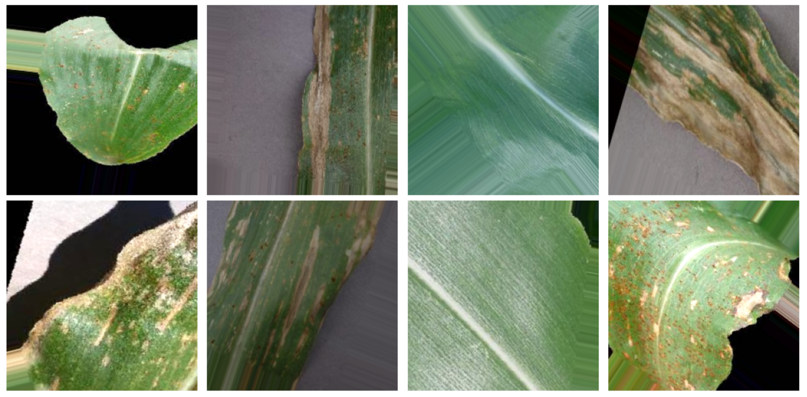
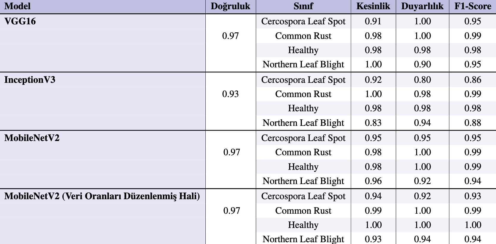
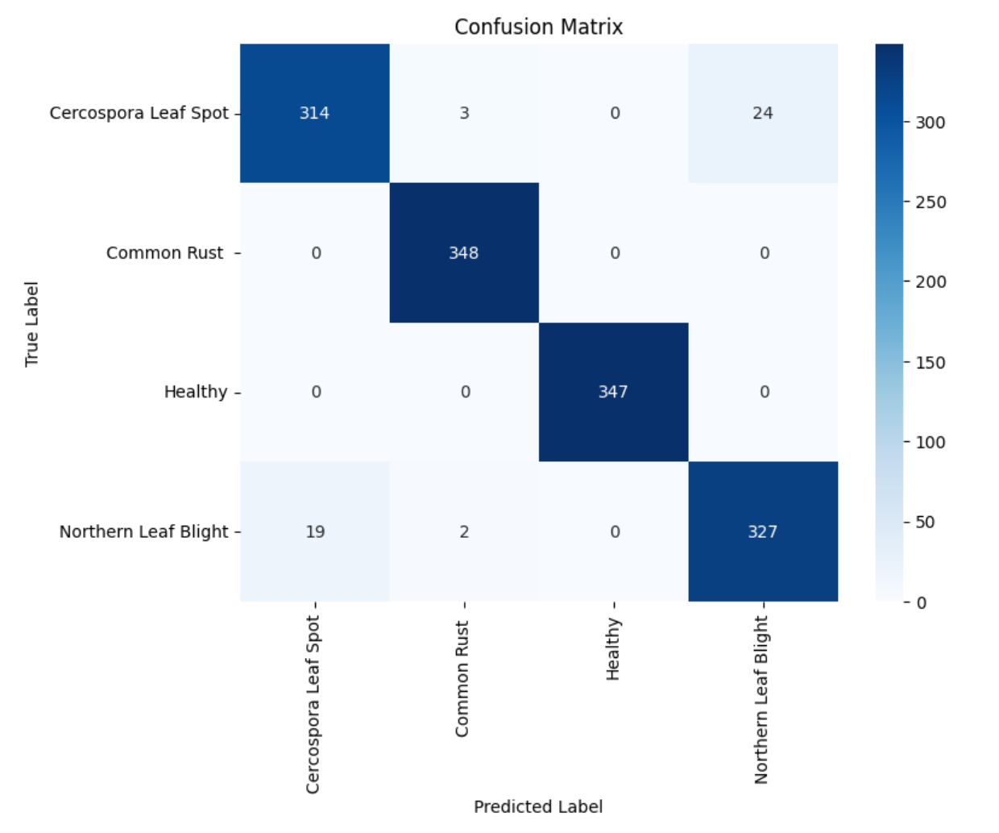
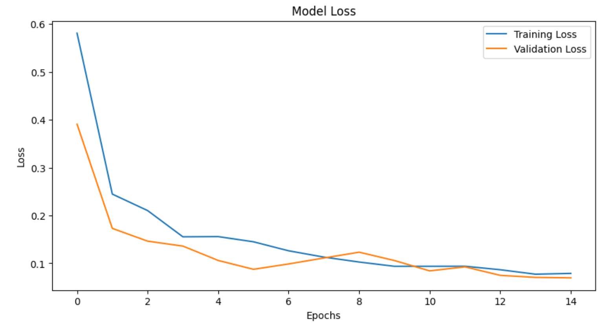
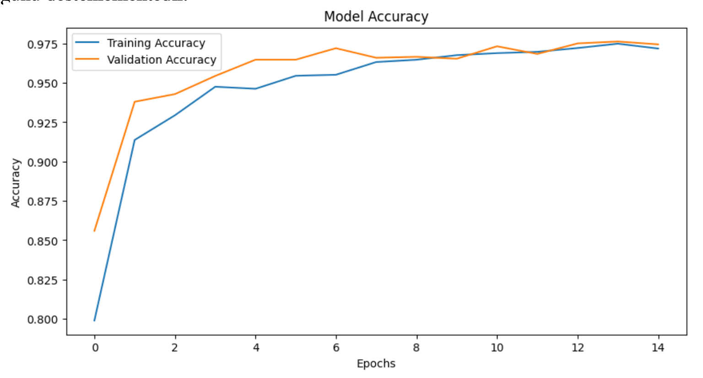
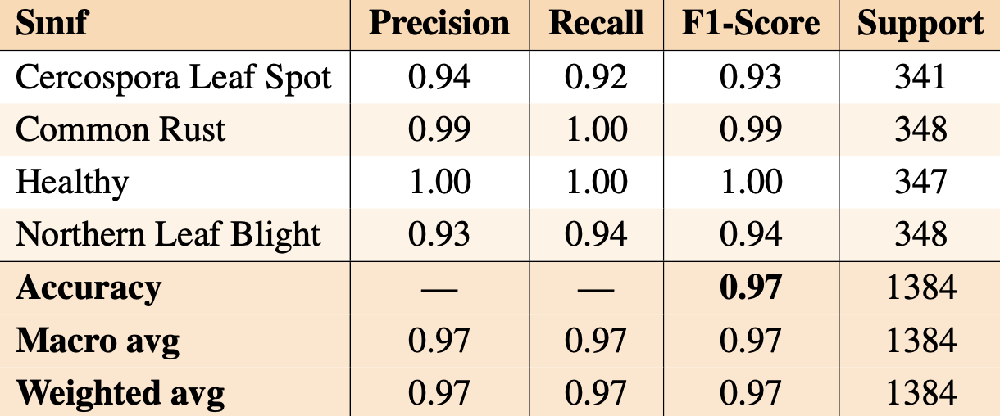
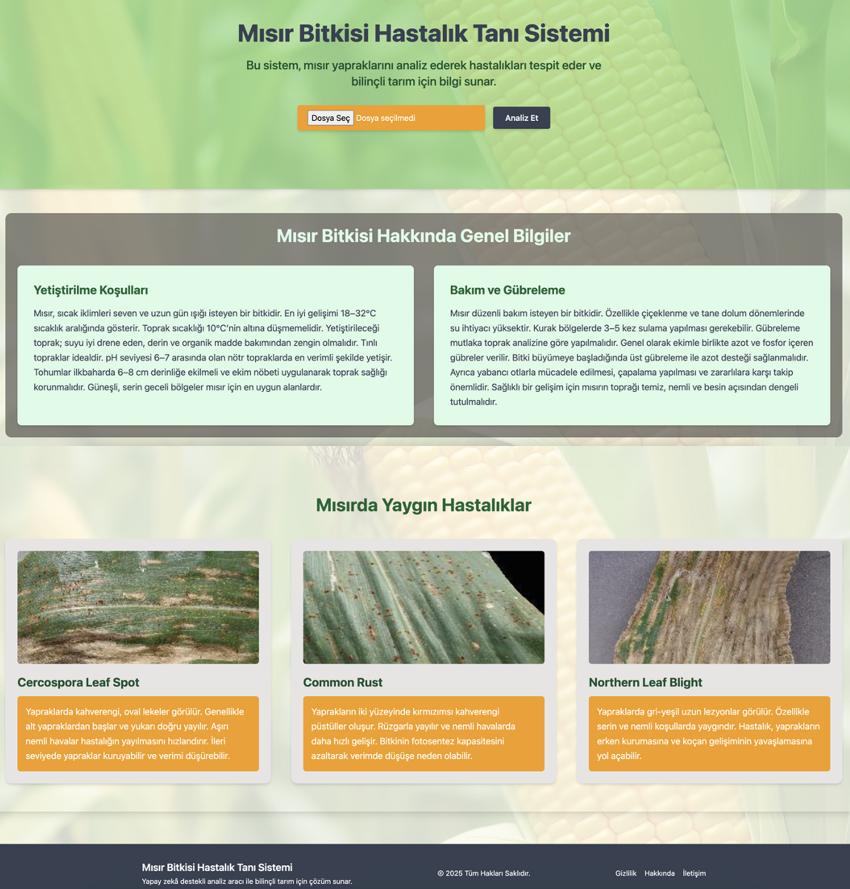

# Derin Öğrenme Tabanlı Bitki Bakım ve Hastalık Tespit Sistemi

## Proje Hakkında
Bu proje, **derin öğrenme** ve **görüntü işleme** teknikleri kullanarak mısır yaprak hastalıklarının otomatik olarak sınıflandırılmasını amaçlamaktadır.  
Amaç; tarımda hızlı, doğru ve kullanıcı dostu bir yapay zekâ destekli sistem geliştirerek, bitki hastalıklarının erken teşhis edilmesini sağlamaktır.

## Hedefler
- Yaprak görüntülerinden **hastalık tespiti** yapmak  
- Farklı derin öğrenme modellerini (VGG16, InceptionV3, MobileNetV2) karşılaştırmak  
- **MobileNetV2** üzerinde fine-tuning ve sezgisel olarak hiperparametre optimizasyonu uygulamak  
- Kullanıcı dostu bir **web arayüzü** geliştirmek  
- Gerçek dünyada uygulanabilir, hızlı ve hafif bir sistem ortaya koymak.

---

## Kullanılan Veri Seti
- **PlantVillage** veri seti (mısır yaprakları, 4 sınıf):  
  - Cercospora Leaf Spot  
  - Common Rust  
  - Northern Leaf Blight  
  - Healthy (sağlıklı yapraklar)

- Görseller: 224×224 piksel, normalize edilmiş  
- Eğitim/Doğrulama/Test oranı: %70 / %15 / %15

---

## Kullanılan Yöntemler
- Ön işleme: Normalize etme, yeniden boyutlandırma  
- Veri artırma: Döndürme, yakınlaştırma, parlaklık ayarı, yatay çevirme vb.
### Veri Artırma ile Oluşan Yaprak Görselleri

- Modeller: VGG16, InceptionV3, MobileNetV2  
- Eğitim ayarları:  
  - Epoch: 10–15  
  - Batch size: 32  
  - Optimizer: Adam (lr=0.00005)  
  - Loss: Categorical Crossentropy

---

## Sonuçlar
- MobileNetV2 modeli %97 doğruluk oranına ulaşmıştır.  
- Kullanıcı dostu web arayüzü sayesinde, yüklenen yaprak görüntüleri analiz edilip sınıflandırma sonucu anında gösterilmektedir.

## Model Sonuçları ve Değerlendirmeler

### Genel Başarım Karşılaştırması

### MobileNetV2 Karmaşıklık Matrisi

### MobileNetV2 Kayıp Grafiği

### MobileNetV2 Doğruluk Grafiği

### MobileNetV2 Başarım Metrikleri

---

## Uygulama Akışı
1. Kullanıcı: Yaprak görselini web arayüzünden yükler  
2. Frontend (React.js): Görseli backend’e iletir  
3. Backend (FastAPI): Görseli işler, TensorFlow modeline gönderir  
4. Model (MobileNetV2): Görseli sınıflandırır  
5. Sonuç: Bitkinin hastalıklı mmı sağlıklı mı olduğu. Hastalıklı ise hangi hastalığa sahip olduğu ve bu hastalık için uygulanabilecek kimyasal ve doğal tedavi yöntemleri önerilir.

## Uygulama Arayüzü

Aşağıda sistemin arayüzüne ait bir ekran görüntüsü yer almaktadır:

---

## Geliştirilebilecek Yönler
- Daha fazla bitki türü ve hastalık eklenmesi  
- Bulut entegrasyonu ile mobil cihazlarda erişim  
- Gerçek zamanlı kamera entegrasyonu  
- Düşük donanımlı cihazlar için hafif model versiyonları 

---

## Belgeler
-  [Proje Raporu (PDF)](docs/Zeynep_Kaya_rapor.pdf)  
-  [Sunum (PPTX)](presentation/Tasarım2_Sunum_Zeynep_Kaya.pptx)  

---

## Geliştirici
**Zeynep Kaya**  

---

